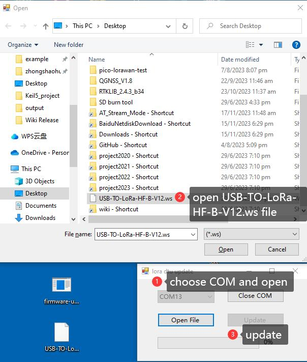

# USB to LoRa HF

The USB-TO-LoRa-xF is a wireless data transfer unit with USB interfaces based on the SX1262 module. Adopts LoRa Modulate and Demodulate technology, with the advantages of anti-interference and long-distance communication (up to 5KM). Supports point-to-point, point-to-multipoint, relay network, AES, etc. Compact size and easy to install.

## How to Restore from Brick

1. Use the Firmware update software on a Windows machine.
2. Put the device into firmware update mode by holding down the KEY button within 3 seconds of powering the device on. The TXD and RXD LED's will flash to show you are in the correct mode.
3. Open the Update software, select the correct COM port and press 'Open COM'.
4. Press on 'Open File' and choose the latest firmware for the corresponding model, such as USB-TO-LoRa-HF-V12.ws, and click the 'Update' button to update.

